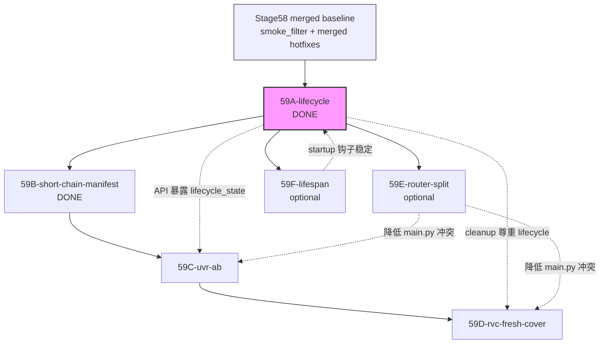

# Stage59 PR 拆分计划（主控文档）

Date: 2026-06-03  
Workspace: `D:\FeiSharkStudio-v2`  
Author: FeiShark Studio 主控（Coordinator）  
Status: **59A-lifecycle DONE**；**59B-short-chain-manifest DONE**（154 pytest）；59C–59F 待排队

---

## 1. 执行摘要

Stage58 用 `smoke_filter.py` 的启发式默认隐藏测试/验收噪声，让 Dashboard / Factory / Studio 在用户视角变干净，但**不能**成为长期真相源：它既不物理删除数据，也无法表达「用户资产 / QA 证据 / 隔离品 / 归档测试 / 发布候选」等正式状态。

Stage59 的目标是把「显式资产生命周期」与「真实素材短链验收」串成可合并、可回滚的 PR 链：

1. **59A-lifecycle**（进行中）：在 `job_artifacts`、`audio_assets`、`voice_models` 上引入 `lifecycle_state`；将 `material_assets.retention_status` 映射到统一枚举；新增 `lifecycle_service`；`file_lifecycle_cleanup` 与列表 API 读生命周期而非仅靠 regex；回填迁移 + 单测。
2. **59B-short-chain-manifest**：在 Stage58 `material_manifest.json` 基础上，定义「真实素材短链」manifest 与 gate（权利、时长、用途、隔离），为后续 UVR/RVC 提供唯一入口清单。
3. **59C-uvr-ab**：对 manifest 中 `listening_acceptance` / `separation` 合格条目跑 capped UVR A/B（干声 vs 分离 stem），对接 Stage49 试听 review 与 Stage45R 分离审计 CLI。
4. **59D-rvc-fresh-cover**：仅在用户显式启动 RVC `7866` 且 preflight 通过后，对短链合格 cover 源提交**全新** cover job（不复用历史 stage smoke 输出）；产出写入带 `lifecycle_state=active` 的 artifact。
5. **59E-router-split**（可选）：将 `backend/main.py`（约 2200+ 行、70+ 路由）按域拆到 `backend/routers/`，降低并行 agent 冲突。
6. **59F-lifespan**（可选）：将 `@app.on_event("startup")` 迁到 FastAPI `lifespan`，统一启动/关闭与后台清理钩子。

**已合并基线（上一会话，不重复开 PR）：**

- `add_voice_asset()` 返回语义：`True`=新插入或实质更新，`False`=完全相同跳过（`tests/unit/test_db_voice_asset.py`）。
- `file_lifecycle_cleanup()` 双表候选：`tasks.task_id` + `jobs.job_id` 去重合并（`tests/unit/test_file_lifecycle_cleanup.py`）。
- 下载路径沙箱：`tests/api/test_download_path_sandbox_api.py`。
- `requirements.txt` 依赖对齐。

Stage59 **不**在单 PR 内做大规模物理删库/删盘；`purged` 状态先表达意图，物理删除需人工或后续 stage。

---

## 2. PR 依赖 DAG



**合并顺序（强制）：** `59A` → `59B` → `59C` → `59D`。`59E` / `59F` 可在 `59A` 之后任意插入，但不得阻塞 B–D 的功能验收；若并行开发，建议 E/F 独立分支，在 B 开 PR 前或 Stage59 收口后合并。

---

## 3. 分 PR 说明

### 3.1 PR `59A-lifecycle`（进行中）

| 项 | 内容 |
| --- | --- |
| **目标** | 用 DB 字段 `lifecycle_state` 替代「仅靠 `smoke_filter` 猜测试数据」作为清理与默认列表的权威来源之一；保留 `include_test_data` 作为 QA 逃生舱。 |
| **依赖** | Stage58 merged baseline |
| **范围** | • Schema：`job_artifacts`、`audio_assets`、`voice_models` 增加 `lifecycle_state TEXT NOT NULL DEFAULT 'active'`<br>• 迁移：按 `smoke_filter.explain_test_data_filter_reason` + job/model metadata 回填 `test_data` / `archived`<br>• `material_assets.retention_status` → `lifecycle_state` 映射函数<br>• 新模块 `backend/services/lifecycle_service.py`：`resolve_lifecycle_state`、`transition_lifecycle`、`should_default_hide`、`is_eligible_for_file_cleanup`<br>• `backend/db.py`：`file_lifecycle_cleanup` 跳过 `lifecycle_state IN ('active','archived')` 且 `is_final=1` 的 artifact 关联路径；终态 job 仅清理 `transient` 中间体<br>• `job_service` / `model_service` / `asset_service`：默认列表 `lifecycle_state NOT IN ('test_data','purged')` 或与 smoke_filter **双轨**（过渡期：lifecycle 优先，无字段时 fallback regex）<br>• API：`VoiceAssetResponse`、`JobArtifactResponse` 等暴露 `lifecycle_state`；可选 `PATCH .../lifecycle`（提升为 user asset / 归档 QA）<br>• 测试：`tests/unit/test_lifecycle_service.py`、`tests/api/test_stage59_lifecycle_api.py` |
| **可能改动文件** | `backend/db.py`, `backend/services/lifecycle_service.py`, `backend/services/job_service.py`, `backend/services/model_service.py`, `backend/services/asset_service.py`, `backend/services/material_library_service.py`, `backend/services/smoke_filter.py`（只读包装，不删）, `backend/main.py`, `tests/unit/test_file_lifecycle_cleanup.py`, `tests/api/test_stage58_user_noise_filter_api.py`（回归） |
| **验收命令** | ```powershell<br>cd D:\FeiSharkStudio-v2<br>python -m py_compile backend\db.py backend\services\lifecycle_service.py backend\services\job_service.py backend\services\model_service.py backend\main.py<br>python -m pytest tests\unit\test_lifecycle_service.py tests\unit\test_file_lifecycle_cleanup.py tests\unit\test_db_voice_asset.py -q<br>python -m pytest tests\api\test_stage59_lifecycle_api.py tests\api\test_stage58_user_noise_filter_api.py -q<br>python -m pytest -q<br>```<br>隔离 self_check（禁止写生产 DB）：复制 `backend/feishark.db` 到 temp 后执行 `python -m backend.self_check` |
| **回滚说明** | • Revert PR；`lifecycle_state` 列可保留（无害）或 down migration 删列<br>• 若已回填 `test_data`，回滚后列表可能再次仅靠 regex——需 re-run Stage58 API 冒烟<br>• **不要**在回滚中执行 `purged` 物理删除 |

---

### 3.2 PR `59B-short-chain-manifest`

| 项 | 内容 |
| --- | --- |
| **目标** | 定义 Stage59「真实素材短链」唯一 manifest：每条记录绑定 `material_id`、`lifecycle_state` 意图、`intended_chain: [preflight, uvr_ab, rvc_cover]`、blocking flags；禁止未入 manifest 的素材进入 59C/59D 自动 runner。 |
| **依赖** | `59A-lifecycle` merged |
| **范围** | • `shared_data/materials/stage59/short_chain_manifest.json`（本地证据，**不入 Git  raw 音频**；可提交 `docs/agent-md/evidence/stage59-short-chain-manifest.redacted.json` 脱敏版）<br>• `backend/verify_stage59_short_chain_manifest.py`：schema `stage59.short_chain.v1`、rights pending gate、时长窗（如 UVR clip 20–60s，cover 20–60s）<br>• `tests/unit/test_stage59_short_chain_manifest.py`<br>• 可选 API：`GET /api/material-library/short-chain` 只读聚合 manifest + DB `material_assets` |
| **可能改动文件** | `backend/verify_stage59_short_chain_manifest.py`, `tests/unit/test_stage59_short_chain_manifest.py`, `backend/services/material_library_service.py`, `backend/main.py`, `docs/agent-md/evidence/`（脱敏 manifest） |
| **验收命令** | ```powershell<br>python -m py_compile backend\verify_stage59_short_chain_manifest.py<br>python backend\verify_stage59_short_chain_manifest.py<br>python -m pytest tests\unit\test_stage59_short_chain_manifest.py -q<br>python backend\verify_stage58_material_quality.py<br>python -m pytest tests\unit\test_stage58_material_quality_manifest.py -q<br>``` |
| **回滚说明** | 删除 verifier + manifest schema 测试即可；59C/59D 应检测 manifest 缺失并 **refuse execute**（dry-run PASS） |

---

### 3.3 PR `59C-uvr-ab`

| 项 | 内容 |
| --- | --- |
| **目标** | 对 short-chain manifest 中标记 `separation` + `listening_acceptance` 的条目执行 **capped** UVR 分离，并在 Studio/CLI 层形成 A/B：源曲 vs vocal stem（对接 Stage49 `listening_review`）。 |
| **依赖** | `59B-short-chain-manifest` merged；59A API 可返回 artifact `lifecycle_state` |
| **范围** | • 扩展 `backend/services/separation_eval_service.py` 或新 `short_chain_uvr_service.py`：只接受 manifest `id` 白名单<br>• CLI：`backend/verify_stage59_uvr_ab.py`（默认 dry-run；`--execute --limit 1 --clip-seconds 45`）<br>• 写入 `job_artifacts`：`artifact_type=uvr_vocal` / `uvr_instrumental`，`lifecycle_state=transient`（中间体）或 `active`（验收通过）<br>• 前端（可薄）：Studio Inspector 链接 Stage49 A/B；或仅 CLI+API 验收<br>• 测试：mock UVR runner；API 测试断言不触发 `train.py` / RVC infer |
| **可能改动文件** | `backend/services/separation_eval_service.py`, `backend/verify_stage59_uvr_ab.py`, `backend/verify_stage45r_separation_quality_audit.py`（复用 env audit）, `backend/main.py`, `frontend/js/studio.js`（可选）, `tests/api/test_stage59_uvr_ab_api.py`, `tests/api/test_stage49_listening_review_api.py`（回归） |
| **验收命令** | ```powershell<br># 默认禁止长任务<br>python backend\verify_stage45r_separation_quality_audit.py<br>python backend\verify_stage59_uvr_ab.py<br>python -m pytest tests\api\test_stage59_uvr_ab_api.py tests\api\test_stage49_listening_review_api.py -q<br># 显式短任务（主控批准 + GPU 空闲）<br>python backend\verify_stage59_uvr_ab.py --execute --limit 1 --clip-seconds 45<br>``` |
| **回滚说明** | Revert PR；已生成的 eval 输出目录保留在 `shared_data/separation_eval/`（不自动删）；将相关 artifact 手动标 `lifecycle_state=archived` |

---

### 3.4 PR `59D-rvc-fresh-cover`

| 项 | 内容 |
| --- | --- |
| **目标** | 在 **用户显式启动 RVC 7866** 且 `GET /api/preflight/cover` 通过后，用 short-chain 合法 cover 源提交**新** cover job；禁止复用 `stage56_actual_*` 等历史 artifact 冒充本轮验收。 |
| **依赖** | `59C-uvr-ab` merged（至少 1 条 separation 试听 `usable` 或 manifest 豁免标记） |
| **范围** | • `backend/verify_stage59_rvc_fresh_cover.py`：检查 7866、`/api/health` RVC online、manifest cover 条目、GPU/observer API（若 live 404 则 TestClient 回退，与 Stage56 报告一致）<br>• 新 job_id 前缀 `stage59_fresh_`；metadata：`short_chain_manifest_id`、`lifecycle_state` 初始 `transient`，完成后 master 为 `active`<br>• 对齐 stage 名：`cover_voice`（现状）在文档中映射 prompt 的 `cover_infer`<br>• 测试：mock cover pipeline；Playwright 可选 `frontend/playwright_stage59_fresh_cover_smoke.cjs`<br>• **边界**：无 20–60s 合法人声则 **blocked**（诚实报告，不伪造 PASS） |
| **可能改动文件** | `backend/verify_stage59_rvc_fresh_cover.py`, `backend/services/preflight_service.py`, `backend/cover_pipeline.py`（或等价）, `backend/main.py`, `tests/api/test_stage59_rvc_fresh_cover_api.py`, `frontend/playwright_stage59_fresh_cover_smoke.cjs`（可选） |
| **验收命令** | ```powershell<br>python -m pytest tests\api\test_stage56_material_preflight_api.py -q<br>python backend\verify_stage59_rvc_fresh_cover.py<br>python -m pytest tests\api\test_stage59_rvc_fresh_cover_api.py -q<br># 仅当 7866 在线 + 主控确认素材<br>python backend\verify_stage59_rvc_fresh_cover.py --execute<br>node frontend\playwright_stage47_e2e_acceptance_dashboard_smoke.cjs<br>``` |
| **回滚说明** | Revert PR；已提交 job 保留，将 `jobs.metadata_json.lifecycle_state` 标 `archived`；不删除 `shared_data/outputs/{job_id}/final_master.wav` |

---

### 3.5 PR `59E-router-split`（可选）

| 项 | 内容 |
| --- | --- |
| **目标** | 将 `backend/main.py` 按域拆分为 `backend/routers/{jobs,models,material,factory,training,studio}.py`，`main.py` 只保留 app 工厂、中间件、`include_router`、静态文件。 |
| **依赖** | `59A-lifecycle` merged（避免与 lifecycle 大 diff 冲突） |
| **范围** | 纯搬迁 + import 调整；**不改**路由路径与 response model；`python -m pytest -q` 全绿。 |
| **可能改动文件** | `backend/main.py`, `backend/routers/*.py`, `backend/app_factory.py`（可选） |
| **验收命令** | ```powershell<br>python -m py_compile backend\main.py backend\routers\*.py<br>python -m pytest -q<br>python -m backend.self_check<br>``` |
| **回滚说明** | 单 PR revert 即可；优先在 59B 开 PR 前合并，否则 rebase 成本高 |

---

### 3.6 PR `59F-lifespan`（可选）

| 项 | 内容 |
| --- | --- |
| **目标** | 用 FastAPI `lifespan` 上下文替代 `@app.on_event("startup")`，将 `init_db()`、目录创建、`recover_stale_compute_state()`、`_dispatch_pending_compute_task()` 纳入可测试的启动/关闭契约。 |
| **依赖** | `59A-lifecycle`；与 `59E` 二选一优先（都动 `main.py`） |
| **范围** | `backend/main.py` 或 `backend/app_lifespan.py`；消除 deprecation 警告；行为等价。 |
| **验收命令** | ```powershell<br>python -m pytest -q<br>python -c "from backend.main import app; print(app)"<br>``` |
| **回滚说明** | Revert 到 `on_event("startup")` |

---

## 4. `lifecycle_state` 枚举契约

| 状态 | 语义 | 默认对用户可见 | 可参与 file_cleanup 中间体删除 | 典型来源 |
| --- | --- | --- | --- | --- |
| `active` | 正式用户资产或当前生效制品 | 是 | 否（保护 final_master / 注册模型） | 用户上传、晋升操作、完成的 cover master |
| `transient` | 流水线中间体（分离 stem、fixed/transformed） | 否（或仅在 job 详情） | **是**（超 retention 天数） | UVR/RVC 中间 wav |
| `archived` | 历史 QA/验收证据，保留只读 | 否（`include_test_data` 或 QA 抽屉） | 否 | Stage47/56 保护记录、人工归档 |
| `purged` | 逻辑删除标记；盘文件可能仍在 | 否 | 视策略（仅 transient 路径） | 用户删除、合规下架 |
| `test_data` | 自动化 smoke/playwright/self_check | 否 | 是（仅 transient + test job） | 回填自 `smoke_filter` |

### 4.1 与 `smoke_filter` / Stage58 的映射

| `smoke_filter` / 行为 | 建议 `lifecycle_state` | 备注 |
| --- | --- | --- |
| `explain_test_data_filter_reason()` 非空 | `test_data` | 回填迁移主规则 |
| `explain_test_data_filter_reason()` 空 + 名称匹配 `_REAL_STAGE_NAME_PATTERN`（stage47/56 real/actual/…） | `archived` 或 `active` | Stage47/56 验收证据：**默认 `archived`**，晋升 API 可到 `active` |
| `include_test_data=true` 仅控制列表可见性 | 不改变 state | QA 逃生舱保留 |
| `metadata.smoke` / `test_scope` in smoke/probe/verify/self_check | `test_data` | 与 Stage58A 一致 |
| `material_assets.retention_status = active` | `active` | |
| `retention_status = quarantined` | `archived`（或单独扩展 `quarantined` 未来） | Stage59 统一进 `archived` + metadata `quarantine=true` |
| `retention_status = review` | `transient` | 待人工确认 |

### 4.2 默认隐藏逻辑（过渡期）

```
default_visible(row) =
  row.lifecycle_state in ('active', 'transient')   # transient 可选：仅 job 内可见
  AND NOT (
    lifecycle_state in ('test_data', 'purged')
    OR (lifecycle_state IS NULL AND smoke_filter.explain(...))
  )
```

目标态：**仅以 `lifecycle_state` 为准**；`smoke_filter` 降级为回填与无列兼容。

---

## 5. 未跟踪 `backend/services` 模块的 Git 提交指引

工作树常见大量 untracked `backend/services/*.py`。Stage59 合并前主控应：

1. **清点**  
   ```powershell
   cd D:\FeiSharkStudio-v2
   git status backend/services/
   git ls-files --others --exclude-standard backend/services/
   ```

2. **按 PR 边界提交（勿一个大杂烩 commit）**  
   - `59A`：`lifecycle_service.py` + 改动到的 `job_service.py` / `model_service.py` / …  
   - `59B`：仅 manifest verifier  
   - 已跟踪模块若仅格式化：单独 `chore:` commit  

3. **推荐 commit message 模板**  
   ```
   feat(stage59A): add lifecycle_state column and lifecycle_service

   - backfill test_data from smoke_filter
   - file_lifecycle_cleanup respects lifecycle_state
   - expose lifecycle_state on job/model/artifact APIs

   Tests: pytest tests/unit/test_lifecycle_service.py tests/api/test_stage59_lifecycle_api.py
   ```

4. **禁止**  
   - 把 `shared_data/**/*.wav|mp3|pth` 提交进 Git  
   - 把本地 `backend/feishark.db` 提交进 Git  
   - 在 59A 中夹带 59C 的 UVR execute 脚本  

5. **若模块已被其他 stage 使用但未入库**  
   先 `git add backend/services/smoke_filter.py`（等 Stage58 已合并则跳过），再 add 本轮增量，避免 agent 重复实现。

---

## 6. 风险登记册

| ID | 风险 | 影响 | 缓解 |
| --- | --- | --- | --- |
| R1 | 59A 回填误判真实 stage 记录为 `test_data` | 用户看不到 Stage47/56 证据 | 回填单元测试覆盖 `_REAL_STAGE_NAME_PATTERN`；提供 promote API |
| R2 | lifecycle 与 smoke_filter 双轨不一致 | 列表条数漂移 | 59A 验收对比 `hidden_test_count` 与 lifecycle 隐藏数；文档化过渡期公式 |
| R3 | 59B manifest 含 rights pending 素材 | 合规风险 | `blocking_flags.manual_rights_pending` 必须为 true 时禁止 59C/59D execute |
| R4 | 59C UVR execute 超时 / GPU 占用 | 阻塞开发机 | 默认 dry-run；`--limit 1 --clip-seconds 45`；主控签字才 execute |
| R5 | Live API 与源码漂移（Stage56 已见 404） | 假 FAIL | verify 脚本 TestClient 回退 + 报告 `live_vs_source` |
| R6 | 59D 无 20–60s 合法 cover 源 | 长期 blocked | 诚实 blocked 报告；不伪造 job |
| R7 | 59E 路由搬迁引入 import 循环 | CI 全挂 | 每域一个 router 文件；`pytest -q` 门控 |
| R8 | `purged` 被误实现为物理删除 | 数据不可恢复 | Stage59 仅逻辑标记；物理删除另开 stage |
| R9 | 并行 agent 同时改 `main.py` | 合并冲突 | 59E 可选且窗口固定；B–D 优先 service 层 |

---

## 7. Stage59 整体 Definition of Done

Stage59 整体视为 **DONE** 当且仅当：

1. **59A–59D 全部合并**，可选 59E/59F 不阻塞 DONE，但若合并须同样全绿。  
2. **数据契约**  
   - `job_artifacts`、`audio_assets`、`voice_models` 存在 `lifecycle_state` 且回填完成；  
   - 默认 API 列表不依赖 regex 即可隐藏 `test_data`（regex 仅 fallback）；  
   - `file_lifecycle_cleanup` 不删除 `active`/`archived` final 制品路径。  
3. **短链 manifest**  
   - `python backend\verify_stage59_short_chain_manifest.py` → `PASS`；  
   - 至少 1 条「可 separation」条目与 0–1 条「可 cover」条目在 manifest 中 **显式标注**（允许 cover 为 blocked）。  
4. **UVR A/B**  
   - dry-run 必 PASS；execute 路径有 redacted 证据（job_id、artifact_id、duration，无原始音频进 Git）；  
   - Stage49 review API 回归 PASS。  
5. **RVC fresh cover**  
   - `verify_stage59_rvc_fresh_cover.py` dry-run PASS；  
   - 若 execute：新 `stage59_fresh_*` job 产生 `final_master` 且 `lifecycle_state=active`；若素材缺失则 documented **blocked**（仍算 Stage59 诚实收口）。  
6. **回归**  
   - `python -m pytest -q` 全绿（基线 ≥ Stage58 的 114 passed）；  
   - `tests/api/test_stage58_user_noise_filter_api.py` 仍 PASS；  
   - `tests/api/test_download_path_sandbox_api.py`、`tests/unit/test_db_voice_asset.py`、`tests/unit/test_file_lifecycle_cleanup.py` 仍 PASS。  
7. **文档**  
   - `docs/agent-md/worker/stage-59-final-acceptance-report.md` 由主控在收口时撰写（本文件为 PR 计划，非最终验收报告）。  
8. **诚实边界**（写入最终报告）  
   - lifecycle 不证明版权；UVR/RVC PASS 不证明听感商用级；7866 必须由用户显式启动。

---

## 8. 主控分工速查

| PR ID | 建议负责人 | 阻塞关系 |
| --- | --- | --- |
| 59A-lifecycle | Parent agent（进行中） | 阻塞 B/C/D |
| 59B-short-chain-manifest | Material/QA worker | 阻塞 C/D |
| 59C-uvr-ab | Audio pipeline worker | 阻塞 D |
| 59D-rvc-fresh-cover | RVC/cover worker | Stage59 关键路径末段 |
| 59E-router-split | Infra worker | 可选 |
| 59F-lifespan | Infra worker | 可选 |

---

## 9. 参考基线（Stage58 → Stage59）

- Stage58 最终验收：`docs/agent-md/worker/stage-58-final-clean-data-quality-acceptance-report.md`  
- 素材质量 gate：`backend/verify_stage58_material_quality.py`  
- 分离审计：`backend/verify_stage45r_separation_quality_audit.py`  
- 试听 A/B：`docs/agent-md/worker/stage-49-listening-review-ab-smoke-report.md`  
- RVC 短链阻塞先例：`docs/agent-md/worker/stage-56b-rvc-cover-smoke-report.md`

---

*本文档仅规划 PR 拆分，不修改 Python 源码。实现状态以各 PR 分支与 `stage-59-final-acceptance-report.md` 为准。*