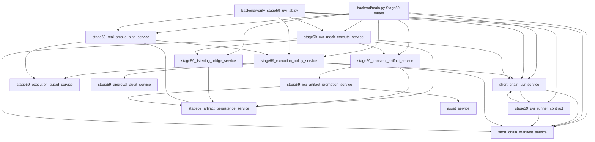
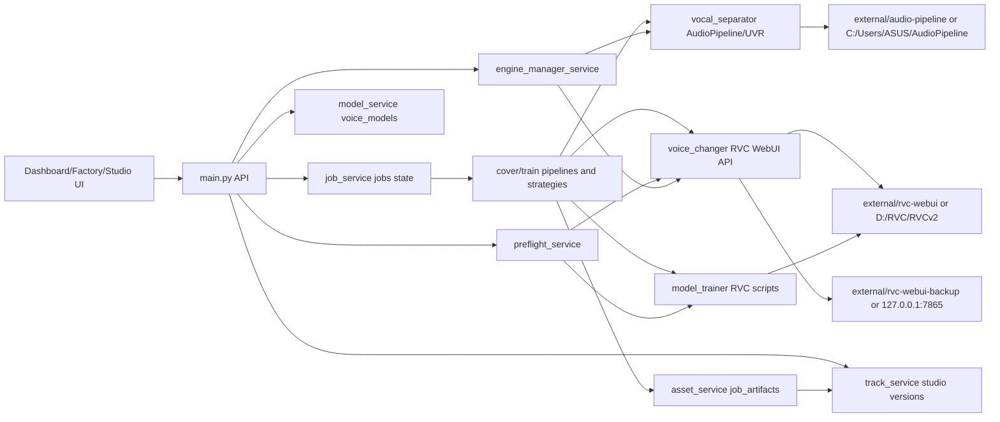

# Stage60A Dependency Inventory and Facade Boundary Review Report

Stage: `Stage60A - Dependency Inventory and Facade Boundary Review`
Status: PASS - governance inventory complete; external runtime limits documented
Workspace: `D:\FeiSharkStudio-v2`

Read declaration: I read `docs/agent-md/handoff/stage-60-governance-memory-snapshot.md` first, followed by `docs/agent-md/handoff/stage-60a-dependency-inventory-handoff.md`, `docs/agent-md/architect/stage-60a-dependency-inventory-facade-boundary-review-prompt.md`, `docs/ARCHITECTURE_CONSTITUTION.md`, ADR 0001/0002/0003, Stage60 governance plans, the RVC/AudioPipeline bundling plan, Stage60 governance report/review, Stage60 bugfix report/review, `worker-report-template.md`, `prompt-template.md`, and the current backend/source/test files listed below. This work strictly follows the Constitution and governance mode.

## 1. Scope

Allowed scope:

- Read-only dependency inventory and facade boundary proposal.
- Static inspection of Stage59 services, routes, CLI verifier, core services, engine manager, RVC/UVR bridge files, launcher, setup script, and tests.
- Running the validation commands from the Stage60A prompt.
- Writing this worker report.

Out of scope and not performed:

- No feature code was written.
- No new `stage59_*` or `stage60_*` service was created.
- No `backend/db.py` migration/backfill/schema change.
- No `main.py` router split or endpoint behavior change.
- No real UVR/RVC/GPU/training job was started.
- No user prepared materials were consumed.
- No `git add` or commit.

Files analyzed:

- Governance and handoff: `docs/agent-md/handoff/stage-60-governance-memory-snapshot.md`, `docs/agent-md/handoff/stage-60a-dependency-inventory-handoff.md`, `docs/agent-md/architect/stage-60a-dependency-inventory-facade-boundary-review-prompt.md`, `docs/ARCHITECTURE_CONSTITUTION.md`, `docs/adr/0001-stage60-governance-sprint-and-process-upgrade.md`, `docs/adr/0002-stage60-debt-audit-stage59-db-legacy.md`, `docs/adr/0003-stage59-consolidation-proposal.md`, `docs/governance/stage60-stage59-service-consolidation-plan.md`, `docs/governance/stage60-db-governance-plan.md`, `docs/governance/stage60-main-router-split-plan.md`, `docs/governance/stage60-legacy-retirement-map.md`, `docs/governance/stage60-training-engine-bundling-plan.md`.
- Stage59 inventory: all `backend/services/stage59_*`, `backend/services/short_chain_manifest_service.py`, `backend/services/short_chain_uvr_service.py`, `backend/verify_stage59_uvr_ab.py`, Stage59 block in `backend/main.py`, Stage59 unit/API tests.
- Core and engine boundary: `backend/services/job_service.py`, `backend/services/asset_service.py`, `backend/services/lifecycle_service.py`, `backend/services/model_service.py`, `backend/services/track_service.py`, `backend/services/preflight_service.py`, `backend/services/engine_manager_service.py`, `backend/voice_changer.py`, `backend/vocal_separator.py`, `backend/model_trainer.py`, `backend/audio_mixer.py`, `backend/pitch_processor.py`, `backend/services/separation_eval_service.py`, `feishark-launcher.ps1`, `scripts/setup_training_engines.ps1`, `.gitignore`.

## 2. Files Changed

Changed by this Stage60A task:

- `docs/agent-md/worker/stage-60a-dependency-inventory-facade-boundary-review-report.md`

Pre-existing dirty tree not created by this report:

- Modified: `.gitignore`, `backend/main.py`, `backend/model_trainer.py`, `backend/self_check.py`, `backend/services/lifecycle_service.py`, `backend/services/stage59_artifact_persistence_service.py`, `backend/services/stage59_execution_guard_service.py`, `backend/services/stage59_job_artifact_promotion_service.py`, `backend/verify_stage59_uvr_ab.py`, `backend/vocal_separator.py`, `backend/voice_changer.py`, `docs/agent-md/README.md`, `docs/agent-md/architect/prompt-template.md`, `feishark-launcher.ps1`, `tests/unit/test_stage59c3_execution_guard_service.py`, `tests/unit/test_stage59c4a_artifact_persistence_contract.py`.
- Untracked: Stage60 governance docs, Stage60 handoffs/prompts/reports, Stage59C-4b service/tests/report, `scripts/`, and this Stage60A prompt/handoff set.

## 3. What Was Done

### Dependency graph

Static AST inspection found 10 milestone-named Stage59 service modules:

- `stage59_approval_audit_service.py`
- `stage59_artifact_persistence_service.py`
- `stage59_execution_guard_service.py`
- `stage59_execution_policy_service.py`
- `stage59_job_artifact_promotion_service.py`
- `stage59_listening_bridge_service.py`
- `stage59_real_smoke_plan_service.py`
- `stage59_transient_artifact_service.py`
- `stage59_uvr_mock_execute_service.py`
- `stage59_uvr_runner_contract.py`

Adjacent Stage59-heavy modules:

- `short_chain_manifest_service.py`
- `short_chain_uvr_service.py`
- `verify_stage59_uvr_ab.py`
- `backend/main.py` Stage59 route block and `Stage59UvrAb*Request` Pydantic models

Mermaid dependency graph:



Core workflow and engine graph:



Data flow inventory:

- Short-chain UVR A/B: manifest -> whitelist/gate -> dry plan -> readiness -> mock execute -> transient/listening/artifact contract -> approval preflight -> real-smoke-plan only. `/execute` remains blocked.
- Cover: source audio -> `job_service` cover job -> `vocal_separator.split_audio` -> `pitch_processor.fix_vocal_pitch` -> `voice_changer.transform_voice` -> `audio_mixer.merge_master_audio` -> `asset_service.register_cover_stage_outputs` and Studio versions.
- Train single long: upload one 30-50 minute dry vocal -> material decision -> `model_trainer.prepare_single_long_preprocess_dataset` -> RVC native `preprocess.py` -> pitch/features/train/index -> `model_service.upsert_voice_model`.
- Train multi clean: upload multiple clean clips -> skip slicing -> `model_trainer.prepare_multi_clean_direct_dataset` -> feature/train/index -> `model_service.upsert_voice_model`.
- Studio track assignment: track cover job stores `voice_model_id` on job metadata, then `track_service` joins `jobs` to `voice_models` and resolves current master/artifact versions for the Studio page.

Tight coupling and risks found:

- `main.py` directly imports Stage59 services and owns Stage59 Pydantic models/routes. This is the highest-value first router extraction candidate.
- `engine_manager_service.py` imports global constants from `voice_changer.py` and `vocal_separator.py`. This means engine discovery depends on runtime bridge modules instead of a neutral engine path contract.
- `voice_changer.py` has primary and backup RVC path variables, but model sync uses only `RVC_WEBUI_DIR` primary assets directories. Backup RVC is only represented as a secondary URL candidate, not as a first-class engine instance.
- `engine_manager_service.list_rvc_models` scans only the primary RVC root. It does not list backup `external/rvc-webui-backup` models as a separate source.
- `model_trainer.py` trains against only the primary `RVC_WEBUI_DIR`. Backup Qiufeng RVC should remain inference/fallback only unless a later ADR explicitly makes it train-capable.
- `external/` does not exist in the current workspace, so current discovery falls back to external installs: `D:\RVC\RVCv2` and `C:\Users\ASUS\AudioPipeline`.
- `.gitignore` contains suspicious typo patterns with spaces: `external/**/ *.pth` and `external/**/ *.onnx`. These do not match intended files and should be a later small bugfix, not part of this inventory.
- Direct DB access remains widespread: static count found 106 textual `get_connection(` occurrences across backend Python files, including 10 in `job_service.py`, 10 in `asset_service.py`, 10 in `track_service.py`, 7 in `model_service.py`, and legacy `tasks` reads in `voice_changer.py`, `vocal_separator.py`, `audio_mixer.py`, `pitch_processor.py`, and `main.py`.

### Interface freeze list

Freeze before any Stage60B import migration:

- `short_chain_manifest_service.py`: `ManifestPathSafetyError`, `ShortChainGateResult`, `project_root_from_here`, `default_manifest_path`, `resolve_safe_manifest_path`, `load_manifest`, `rights_gate_allows_entry`, `entry_blocking_reasons`, `validate_manifest_structure`, `validate_manifest`, `evaluate_short_chain_gate`, `build_short_chain_whitelist`, `summarize_manifest`.
- `short_chain_uvr_service.py`: `Stage59UvrBlockedError`, `plan_short_chain_uvr`, `select_uvr_ab_entries`, `plan_dry_run`, `evaluate_uvr_ab_readiness`, constants such as `STAGE59C0_EXECUTE_BLOCK_REASON` and `UVR_STAGE`.
- `stage59_uvr_runner_contract.py`: `RunnerMode`, `UvrAbArtifactContract`, `UvrAbRunnerPlan`, `UvrAbRunnerRequest`, `MockUvrAbRunner.run`, `RealUvrAbRunnerAdapter.run`, `build_runner_request`, `evaluate_runner_readiness`, `evaluate_runner_readiness_from_paths`; real runner remains blocked.
- `stage59_execution_policy_service.py`: `ExecutionMode`, `evaluate_execution_policy`, `REAL_RUNNER_NOT_ENABLED_REASON`.
- `stage59_execution_guard_service.py`: `validate_caps`, `plan_sandbox`, `validate_disk_preflight`, `evaluate_execution_guards`, caps for max items, clip seconds, timeout, sandbox root, disk check.
- `stage59_approval_audit_service.py`: `record_audit_event`, `list_audit_events`, `clear_audit_store`; currently memory-backed.
- `stage59_artifact_persistence_service.py`: `safe_runtime_run_id`, `stable_artifact_id`, `planned_sandbox_path`, `build_artifact_contract_record`, `build_mock_uvr_artifact_contracts`, `build_file_backed_uvr_artifact_contracts`, `validate_artifact_contract_record`, `build_run_persistence_bundle`, `store_run_artifact_contract`, `get_run_artifact_contract`, `clear_persistence_store`, contract schema/kind constants.
- `stage59_job_artifact_promotion_service.py`: `build_job_artifact_promotion_plan`, `promote_file_backed_uvr_artifacts`; must preserve sandbox validation and `asset_service.register_job_artifact` handoff.
- `stage59_transient_artifact_service.py`: `register_transient_uvr_artifacts`, `attach_listening_contract`, `get_transient_run`, `get_artifact_contract_for_run`, `list_transient_artifact_records`, `clear_transient_store`.
- `stage59_listening_bridge_service.py`: `build_listening_contract`, `get_listening_contract_for_run`, `stage59_uvr_listening_bridge_v1` schema.
- `stage59_uvr_mock_execute_service.py`: `mock_execute_uvr_ab`; must remain metadata-only and `audio_files_written=false`.
- `stage59_real_smoke_plan_service.py`: `build_expected_real_smoke_artifacts`, `evaluate_real_smoke_plan`; must keep `real_execute_allowed=false`.
- `backend/verify_stage59_uvr_ab.py`: CLI modes `--dry-run`, `--readiness`, `--mock-execute`, `--artifact-contract`, `--approval-preflight`, `--real-smoke-plan`, `--confirm-execute`, `--approval-token`, `--skip-file-exists`, `--runner`; CLI must not start real UVR/RVC.
- `backend/main.py` Stage59 API endpoints: `GET /api/stage59/short-chain/uvr-ab/contract`, `POST /plan`, `POST /readiness`, `POST /mock-execute`, `GET /mock-execute/{run_id}/listening-contract`, `GET /mock-execute/{run_id}/artifact-contract`, `POST /approval-preflight`, `POST /real-smoke-plan`, `POST /execute` blocked.
- `backend/main.py` Pydantic request models: `Stage59UvrAbPlanRequest`, `Stage59UvrAbReadinessRequest`, `Stage59UvrAbMockExecuteRequest`, `Stage59UvrAbApprovalPreflightRequest`, `Stage59UvrAbRealSmokePlanRequest`.
- Engine/model interfaces: `engine_manager_service.scan_engines`, `list_rvc_models`, `get_rvc_engine`, `get_uvr_engine`, `get_svc_fallback_engine`; `model_service.import_voice_model`, `rescan_voice_models`, `list_models`, `resolve_voice_model_file`; `preflight_service.run_train_preflight`, `run_cover_preflight`; `voice_changer.transform_voice`, `get_rvc_service_status`, `get_engine_summary`; `model_trainer.start_*`, `prepare_*`, `run_training_*`, `register_trained_model`, `build_training_command_preview`; `vocal_separator.split_audio`.

### Proposed facade boundaries

This is a proposal only. No facade files were created in Stage60A.

1. `short_chain_service.py`

- Owns manifest path safety, rights gate, whitelist, chain stage eligibility, dry-run/plan shape.
- Absorbs `short_chain_manifest_service.py` and `short_chain_uvr_service.py` behind a stable facade.
- Migration approach: create facade first, keep old modules as thin delegates, migrate `main.py`, CLI, and tests only after freeze tests pass.

2. `execution_safety_service.py`

- Owns caps, timeout, sandbox preflight, approval policy, explicit confirmation, approval audit.
- Absorbs `stage59_execution_guard_service.py`, `stage59_execution_policy_service.py`, `stage59_approval_audit_service.py`.
- Must keep real runner disabled by default and preserve audit events.

3. `artifact_lifecycle_service.py`

- Owns persistence contract records, transient records, file-backed promotion plan, listening bridge metadata, cleanup/purge policy.
- Absorbs `stage59_artifact_persistence_service.py`, `stage59_job_artifact_promotion_service.py`, `stage59_transient_artifact_service.py`, `stage59_listening_bridge_service.py`.
- Must not directly expand DB schema in this step. It can call existing `asset_service.register_job_artifact` until repository governance exists.

4. `uvr_smoke_service.py`

- Owns UVR A/B mock execution, real-smoke-plan generation, and future real runner adapter boundary.
- Absorbs `stage59_uvr_mock_execute_service.py`, `stage59_real_smoke_plan_service.py`, `stage59_uvr_runner_contract.py`.
- Must keep real execution disabled unless a later human-approved ADR explicitly opens real UVR/RVC execution.

Suggested migration order:

1. Freeze tests and snapshot public interfaces.
2. Introduce proposed durable facades with old modules delegating inward or facades delegating outward, but no behavior change.
3. Update imports in tests and CLI first, then `main.py`.
4. Extract Stage59 route block to an APIRouter after facade import migration is stable.
5. Delete old `stage59_*` shims only after all imports and tests are green.

### RVC main + Qiufeng/秋风RVC backup + AudioPipeline bundling proposal

Current observed state:

- `external/` is missing in the workspace.
- `voice_changer.py` and `model_trainer.py` prefer `external/rvc-webui` then `external/rvc`, then old external paths.
- `voice_changer.py` has backup path candidates `external/rvc-webui-backup` and `external/rvc-qiufeng`, and URL fallbacks `http://127.0.0.1:7866` then `http://127.0.0.1:7865`.
- `vocal_separator.py` prefers `external/audio-pipeline`, then `D:\AudioPipeline`, then `C:\Users\ASUS\AudioPipeline`.
- `feishark-launcher.ps1` starts main RVC on 7866 and, if found, backup RVC on 7865. It still opens FeiShark UI on 8000, not RVC.
- `scripts/setup_training_engines.ps1` prepares `external/rvc-webui`, `external/rvc-webui-backup`, and `external/audio-pipeline`, but it is currently a bootstrap/skeleton helper and does not prove complete runtime dependencies.
- `engine_manager_service` surfaces only `rvc_webui`, `uvr`, and `svc_fallback`. It does not expose a separate `rvc_webui_backup` engine key.

Recommended target shape:

- `external/rvc-webui`: complete primary RVC-WebUI, primary training and inference engine, port 7866.
- `external/rvc-webui-backup`: complete backup RVC-WebUI instance for Qiufeng/秋风RVC or other known-good fallback model, inference fallback only by default, port 7865.
- `external/audio-pipeline`: complete AudioPipeline/UVR5 runtime and models, including `run_uvr5_split.py`, venv, and `models/UVR-MDX-NET-Voc_FT.onnx`.
- Environment overrides remain first-class: `FEISHARK_RVC_DIR`, `FEISHARK_RVC_PYTHON`, `FEISHARK_RVC_API`, `FEISHARK_RVC_BACKUP_DIR`, `FEISHARK_RVC_BACKUP_PORT`, `FEISHARK_AUDIO_PIPELINE`.
- A future non-service path resolver module such as `backend/engine_paths.py` can centralize candidate paths and ports. This should be proposed in Stage60B/C as a pure resolver, not as another service. If human wants fewer files, the same contract can be folded into `engine_manager_service.py`, but the current duplicated constants should not keep spreading.
- `engine_manager_service` should expose primary and backup RVC as separate read-only engine records: `rvc_webui` and `rvc_webui_backup`, each with root path, port/base_url, checks, model count, registered matches, warnings, and next step.
- `list_rvc_models` should accept an engine selector or include a `source_engine` field so Studio can distinguish primary models from backup Qiufeng models.
- `model_service.import_voice_model` and `/api/models/import-rvc` should store origin metadata: `origin_kind=external_rvc_primary` or `external_rvc_backup`, `engine_key`, `rvc_root`, `rvc_base_url`, `source_pth_path`, `source_index_path`.
- `track_service` and Studio track assignment should keep using `voice_model_id`; do not bind tracks to raw RVC paths. Engine origin belongs in model metadata and preflight details.
- `voice_changer.transform_voice` should choose engine by model metadata in a future stage: primary default, backup when model origin says backup or primary is unavailable. Current fallback by URL alone is not enough to guarantee the correct model is loaded on the correct WebUI instance.
- `model_trainer.py` should train only on the primary RVC by default. Backup Qiufeng RVC should not receive training writes unless human approves a separate backup-training ADR.
- `vocal_separator.py` should keep AudioPipeline workspace-relative after env override, and real UVR execution remains blocked in governance-only work.
- `.gitignore` should be fixed in a later tiny bugfix to remove the spaces in `external/**/ *.pth` and `external/**/ *.onnx`, and to explicitly cover `external/rvc-webui-backup/` binaries/models/logs.

### Exact tests required before any import migration

Freeze gate for Stage60B:

- `python -m pytest -q`
- Expanded Stage59 suite: `tests/unit/test_stage59c*.py` and `tests/api/test_stage59*.py`
- Existing Stage59 legacy tests: `tests/unit/test_stage59_short_chain_manifest.py`, `tests/api/test_stage59_uvr_ab_api.py`
- CLI checks: `python backend\verify_stage59_short_chain_manifest.py --manifest docs\agent-md\evidence\stage59-short-chain-manifest.redacted.json --skip-file-exists`, plus `verify_stage59_uvr_ab.py` dry-run/readiness/mock/artifact-contract/approval-preflight/real-smoke-plan with `--skip-file-exists`.
- Contract tests: manifest path safety, runner readiness, caps validation, sandbox run-id exact segment validation, artifact contract schema, file-backed promotion plan, transient store/listening bridge, real-smoke-plan `real_execute_allowed=false`.
- API tests: every `/api/stage59/short-chain/uvr-ab/*` endpoint must preserve payload shape, status codes, and blocked execute behavior.
- Engine tests: `scan_engines`, `list_rvc_models`, primary/backup path resolution, no 8000 launcher jump to 7866, backup port 7865 discovery, no real infer/train side effects.
- Model tests: `/api/models/import-rvc`, `/api/models/rescan`, `model_service.resolve_voice_model_file`, model metadata origin fields after backup support is added.
- Train preflight tests: structure checks remain separate from runtime environment readiness; missing `torch/faiss/sklearn` stays runtime failure, not code-contract failure.
- Cover preflight tests: offline/online RVC cases, model load probe mocked, primary vs backup model routing mocked.
- Asset tests: `git ls-files` raw asset scan must stay empty; no `.wav/.mp3/.flac/.pth/.index/.db` enters git.
- Self-check: `CODE_STRUCTURE_SUMMARY PASS` is required before migration; `RUNTIME_ENVIRONMENT_SUMMARY PASS` should become required only after workspace `external/` engines are complete.

## 4. Debt Delta

Debt added:

- 1 governance report file.
- No runtime service files, routes, DB migrations, feature code, or test code were added in this Stage60A task.

Debt reduced:

- Inventoried all 10 milestone-named Stage59 service modules and their incoming/outgoing dependencies.
- Froze public interfaces for Stage59, engine/model, preflight, and Studio track boundaries before code movement.
- Identified the exact facade split needed to compress Stage59 service sprawl.
- Identified the external engine fragility path: current runtime falls back to `D:\RVC\RVCv2` and `C:\Users\ASUS\AudioPipeline` because workspace `external/` is missing.
- Identified backup Qiufeng/秋风RVC gap: launcher and URL fallback exist, but engine manager/model metadata do not yet model backup as a first-class engine.

Net debt assessment:

- Negative at governance/planning level, neutral at runtime level. The codebase behavior and service count are unchanged, but the next migration can now be bounded and tested instead of improvised.

Quantification:

- Stage59 milestone services inventoried: 10.
- Stage59 adjacent modules inventoried: 3 plus `main.py` route block.
- Stage59 API endpoints frozen: 9.
- Stage59 request models frozen: 5.
- Direct backend DB access textual count: 106 `get_connection(` occurrences observed for later DB governance inventory.
- New runtime behavior: 0.
- New tracked raw assets: 0.

## 5. Invariant Violations

No known Constitution violations.

- No new milestone-named service was created.
- No `backend/db.py` change was made.
- No `main.py` expansion or router change was made.
- No real UVR/RVC/GPU/training execution was started. The engine scan performed only read-only status probes to existing local endpoints as required by the prompt.
- No raw audio/model/DB assets were tracked.

## 6. Simplification Opportunities

- Replace 10 `stage59_*` services with 4 durable facade boundaries after human approval and test freeze.
- Extract Stage59 routes from `main.py` only after facade boundaries are approved; route extraction should not change endpoint paths in the first pass.
- Centralize RVC/UVR path resolution into a pure non-service resolver or one existing service boundary to stop duplicated path constants.
- Add first-class backup RVC engine metadata instead of relying on generic `RVC_FALLBACK_BASES`.
- Fix `.gitignore` typo patterns for `external/**/ *.pth` and `external/**/ *.onnx`.
- Add read-only/temp-DB mode to `self_check.py`; current self-check creates smoke records in ignored runtime DB.
- Start DB repository/migration inventory after Stage59 facade work, because direct DB access is widespread and should not be mixed into Stage60A.

## 7. Validation

Command:

```powershell
python -m pytest -q
```

Result:

```text
288 passed, 2 warnings in 83.70s (0:01:23)
Warnings: FastAPI on_event deprecation in backend/main.py:413 and fastapi applications.py.
```

Command:

```powershell
python -X utf8 backend\self_check.py
```

Result:

```text
Exit code: 1
CODE_STRUCTURE_SUMMARY PASS
RUNTIME_ENVIRONMENT_SUMMARY FAIL
SELF_CHECK_SUMMARY FAIL

Key failing runtime checks:
- python_import:fairseq failed because D:\RVC\RVCv2\fairseq imports torch and torch is missing.
- python_import:faiss failed: ModuleNotFoundError: No module named 'faiss'.
- python_import:sklearn failed: ModuleNotFoundError: No module named 'sklearn'.
- train_gpu_torch_cuda failed: No module named 'torch'.
- train_gpu_selection failed: selected=[0]; device_count=0.

Important passing checks:
- duplicate routes PASS
- health engine summary PASS
- engine manager contract PASS
- launcher guard PASS
- models/jobs/default hide smoke checks PASS
- train preflight structure PASS
- train material routing PASS
- cover preflight usable model PASS with external_rvc_offline=True in that specific check
- retry/requeue/cancel flow PASS
- real train index artifact PASS
```

Command as written in prompt:

```powershell
python -m pytest tests/unit/test_stage59c* tests/api/test_stage59* -q --tb=short
```

Result:

```text
Exit code: 1
ERROR: file or directory not found: tests/unit/test_stage59c*
2 warnings in 0.00s
```

Reason: PowerShell passed the wildcard literally to pytest in this invocation.

Equivalent expanded command:

```powershell
$targets = @((Get-ChildItem -LiteralPath 'tests\unit' -Filter 'test_stage59c*.py').FullName) + @((Get-ChildItem -LiteralPath 'tests\api' -Filter 'test_stage59*.py').FullName); python -m pytest @targets -q --tb=short
```

Result:

```text
133 passed, 2 warnings in 4.84s
Warnings: FastAPI on_event deprecation in backend/main.py:413 and fastapi applications.py.
```

Command:

```powershell
python -c "from backend.services.engine_manager_service import scan_engines, list_rvc_models; print(scan_engines('.', 'shared_data/weights', force=True)); print(list_rvc_models('.', 'shared_data/weights', limit=20, registered='all'))"
```

Result summary:

```text
Exit code: 0
scan_engines read_only=True
rvc_webui status=online
rvc_webui base_url=http://127.0.0.1:7866
rvc_webui root_path=D:\RVC\RVCv2
rvc_webui model_count=400
uvr status=online
uvr root_path=C:\Users\ASUS\AudioPipeline
uvr model=UVR-MDX-NET-Voc_FT.onnx
svc_fallback status=not_configured
list_rvc_models total=400 limit=20 root_path=D:\RVC\RVCv2 status=online
First returned models are external_rvc rows under D:\RVC\RVCv2\assets\weights and D:\RVC\RVCv2\assets\indices.
No workspace external/rvc-webui or external/rvc-webui-backup root was surfaced because external/ is currently missing.
```

Command:

```powershell
python -c "import os; print('RVC_DIR candidates would prefer external now'); print('Check external/rvc-webui and backup dirs exist or not')"
```

Result:

```text
RVC_DIR candidates would prefer external now
Check external/rvc-webui and backup dirs exist or not
```

Additional dry path check:

```powershell
if (Test-Path -LiteralPath 'external') { Get-ChildItem -LiteralPath 'external' -Force } else { 'external directory missing' }
```

Result:

```text
external directory missing
```

Command:

```powershell
git ls-files | Select-String -Pattern '(\.wav|\.mp3|\.flac|\.m4a|\.aac|\.ogg|\.pth|\.index|\.sqlite|\.db)$' | Select-Object -First 5
```

Result:

```text
No output.
```

Command:

```powershell
git status --porcelain
```

Result before writing this report:

```text
 M .gitignore
 M backend/main.py
 M backend/model_trainer.py
 M backend/self_check.py
 M backend/services/lifecycle_service.py
 M backend/services/stage59_artifact_persistence_service.py
 M backend/services/stage59_execution_guard_service.py
 M backend/services/stage59_job_artifact_promotion_service.py
 M backend/verify_stage59_uvr_ab.py
 M backend/vocal_separator.py
 M backend/voice_changer.py
 M docs/agent-md/README.md
 M docs/agent-md/architect/prompt-template.md
 M feishark-launcher.ps1
 M tests/unit/test_stage59c3_execution_guard_service.py
 M tests/unit/test_stage59c4a_artifact_persistence_contract.py
?? backend/services/stage59_real_smoke_plan_service.py
?? docs/ARCHITECTURE_CONSTITUTION.md
?? docs/adr/
?? docs/agent-md/architect/governance-reviewer-prompt.md
?? docs/agent-md/architect/stage-59c4b-real-smoke-plan-and-file-backed-promotion-prompt.md
?? docs/agent-md/architect/stage-60-bugfix-small-debt-fixes-prompt.md
?? docs/agent-md/architect/stage-60-governance-sprint-prompt.md
?? docs/agent-md/architect/stage-60a-dependency-inventory-facade-boundary-review-prompt.md
?? docs/agent-md/handoff/stage-60-bugfix-task-handoff.md
?? docs/agent-md/handoff/stage-60-governance-memory-snapshot.md
?? docs/agent-md/handoff/stage-60a-dependency-inventory-handoff.md
?? docs/agent-md/worker/stage-59c4b-real-smoke-plan-report.md
?? docs/agent-md/worker/stage-60-bugfix-review.md
?? docs/agent-md/worker/stage-60-bugfix-small-debt-fixes-report.md
?? docs/agent-md/worker/stage-60-governance-review.md
?? docs/agent-md/worker/stage-60-governance-sprint-report.md
?? docs/agent-md/worker/worker-report-template.md
?? docs/governance/
?? scripts/
?? tests/api/test_stage59c4b_real_smoke_plan_api.py
?? tests/unit/test_self_check_train_preflight.py
?? tests/unit/test_stage59c4b_file_backed_promotion.py
?? tests/unit/test_stage59c4b_real_smoke_plan_service.py
?? tests/unit/test_stage59c4b_verify_real_smoke_plan_cli.py
?? tests/unit/test_vocal_separator_import.py
```

Command:

```powershell
git diff --stat
```

Result before writing this report:

```text
 .gitignore                                         |  25 ++++
 backend/main.py                                    |  45 +++++++
 backend/model_trainer.py                           |   5 +-
 backend/self_check.py                              |  13 +-
 backend/services/lifecycle_service.py              |   4 +-
 .../stage59_artifact_persistence_service.py        |  95 +++++++++++--
 .../services/stage59_execution_guard_service.py    |  14 +-
 .../stage59_job_artifact_promotion_service.py      | 149 ++++++++++++++++++---
 backend/verify_stage59_uvr_ab.py                   |  85 +++++++++++-
 backend/vocal_separator.py                         |   5 +-
 backend/voice_changer.py                           |  12 ++
 docs/agent-md/README.md                            |  44 ++++--
 docs/agent-md/architect/prompt-template.md         |  35 +++--
 feishark-launcher.ps1                              |  51 +++++++
 .../unit/test_stage59c3_execution_guard_service.py |   8 +-
 ...est_stage59c4a_artifact_persistence_contract.py |  16 ++-
 16 files changed, 549 insertions(+), 57 deletions(-)
```

## 8. Known Limits

- `self_check.py` does not fully pass because the current external RVC training Python lacks `torch`, `faiss`, and `sklearn`, and GPU selection reports `device_count=0`.
- Current RVC detection points to `D:\RVC\RVCv2`, not workspace `external/rvc-webui`.
- Current UVR detection points to `C:\Users\ASUS\AudioPipeline`, not workspace `external/audio-pipeline`.
- `external/` is absent, so Stage60A could not prove self-contained engine completeness.
- Backup Qiufeng/秋风RVC is not first-class in `engine_manager_service`; launcher and fallback URL exist, but scanning/import/preflight do not yet distinguish backup engine models.
- The prompt's exact Stage59 wildcard command fails under this PowerShell invocation; the expanded equivalent passes.
- Some governance docs display garbled Chinese when read through this shell, but the machine-readable paths, rules, and plans were still usable.
- This report intentionally did not clean the dirty working tree. Commit hygiene remains a separate human/coordinator step.

## 9. Next Recommended Step

Proceed to a human-reviewed `Stage60B` prompt for facade introduction only:

- Create durable facades proposed above.
- Keep old Stage59 modules as thin compatibility wrappers.
- Do not delete old modules in the first implementation pass.
- Do not change API behavior.
- Do not run real UVR/RVC/GPU/training.
- Add or adjust only tests needed to prove zero behavior change.

Recommended Stage60B acceptance gate:

- Full pytest green.
- Expanded Stage59 unit/API suite green.
- `verify_stage59_uvr_ab.py` dry/mock/approval/real-smoke-plan CLI green.
- Engine scan still read-only.
- No raw assets tracked.
- Worker report includes Debt Delta, Invariant Violations, and Simplification Opportunities.

Separate follow-up after Stage60B:

- Stage60C or Stage60B-Infra should implement workspace engine bundling boundary for `external/rvc-webui`, `external/rvc-webui-backup`, and `external/audio-pipeline`, including backup RVC as a first-class read-only engine in `engine_manager_service`.
